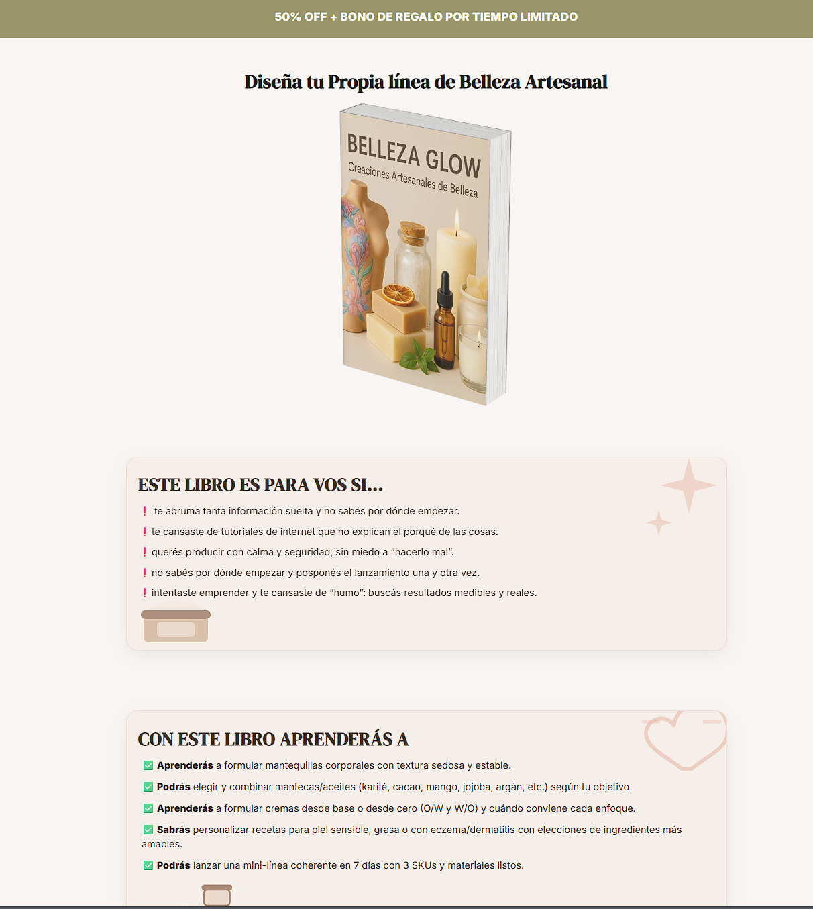
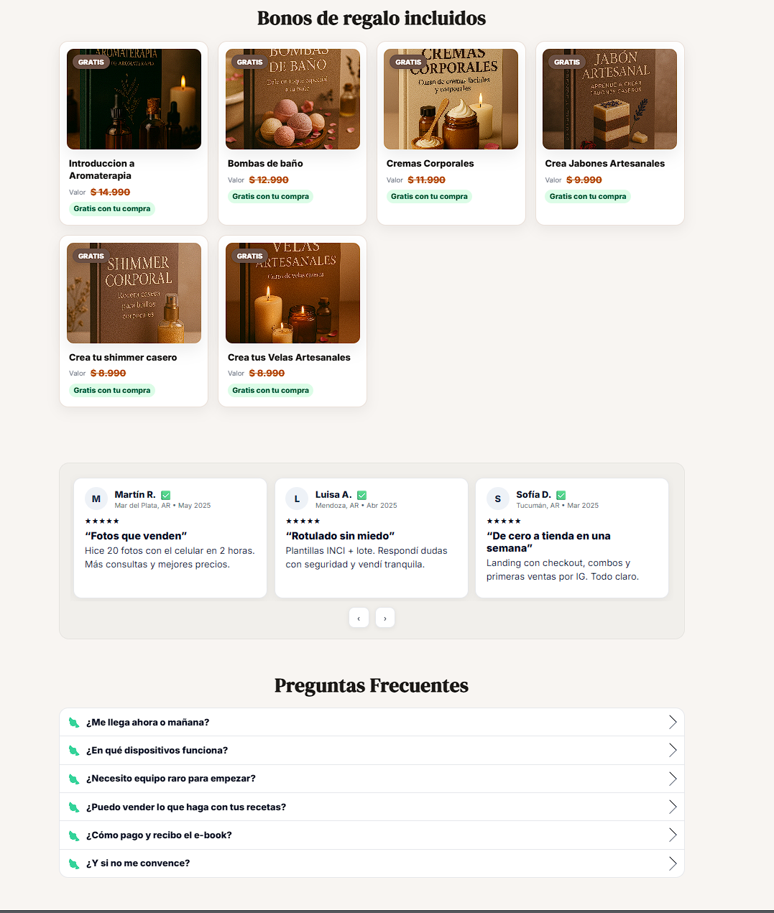

# BellezaGlow

Landing page de venta para un **curso de cremas artesanales**, optimizada para conversión (CTA, secciones de valor, responsive) y desplegada en producción.

**Sitio en producción:** bellezaglow.com

---

## ✨ Qué resuelve

- Presenta la oferta del curso de forma clara (beneficios, contenido, testimonios, preguntas frecuentes).
- Incluye CTA de compra y flujo de pago (Mercado Pago).
- Diseño responsive y performance-oriented (carga rápida + estructura simple).

---

## 🧰 Stack

- **Frontend:** React + Vite (SPA)
- **Estilos:** Tailwind 
- **Deploy:** Vercel
- **Pagos:** Mercado Pago ( Checkout )

> Nota: El repo incluye una carpeta `/api` para endpoints (por ejemplo, integraciones o utilidades serverless en Vercel).

---

## 📁 Estructura del proyecto

- `src/` → componentes, páginas y lógica principal
- `public/` → assets estáticos
- `data/` → contenido/constantes (textos, secciones, etc.)
- `api/` → endpoints serverless (Vercel)
- `vercel.json` → configuración de deploy / rewrites
- `vite.config.js` → configuración de Vite

---

## ⚙️ Requisitos

- Node.js **18+** (recomendado)

---

## ▶️ Cómo correrlo local

```bash
npm install
npm run dev
```

---


##  Links útiles
```md
**Sitio en producción:** https://bellezaglow.com  
**Repositorio:** https://github.com/Fran3103/bellezaGlow
```

## 🔌 Endpoints (Vercel Serverless)

- `POST /api/mp-preference` → crea preferencia y devuelve `init_point`
- `POST /api/mp-webhook` → recibe notificaciones y envía email con enlaces de descarga
- `GET /api/go?u=ebook1` → redirección segura a recursos (URL via env)


## 🚀 Deploy
- Deploy en Vercel conectado a GitHub (auto-deploy por push).

## 🔐 Variables de entorno

Configurar en Vercel (Project Settings → Environment Variables):

- `MP_ACCESS_TOKEN`
- `PRICE_AR`
- `PUBLIC_SITE_URL`
- `RESEND_API_KEY`
- `DOWNLOAD_URLS` (ej: `ebook1|Descargar eBook`)
- `EBOOK1_URL` (`/api/go.js` para redirección)

  



